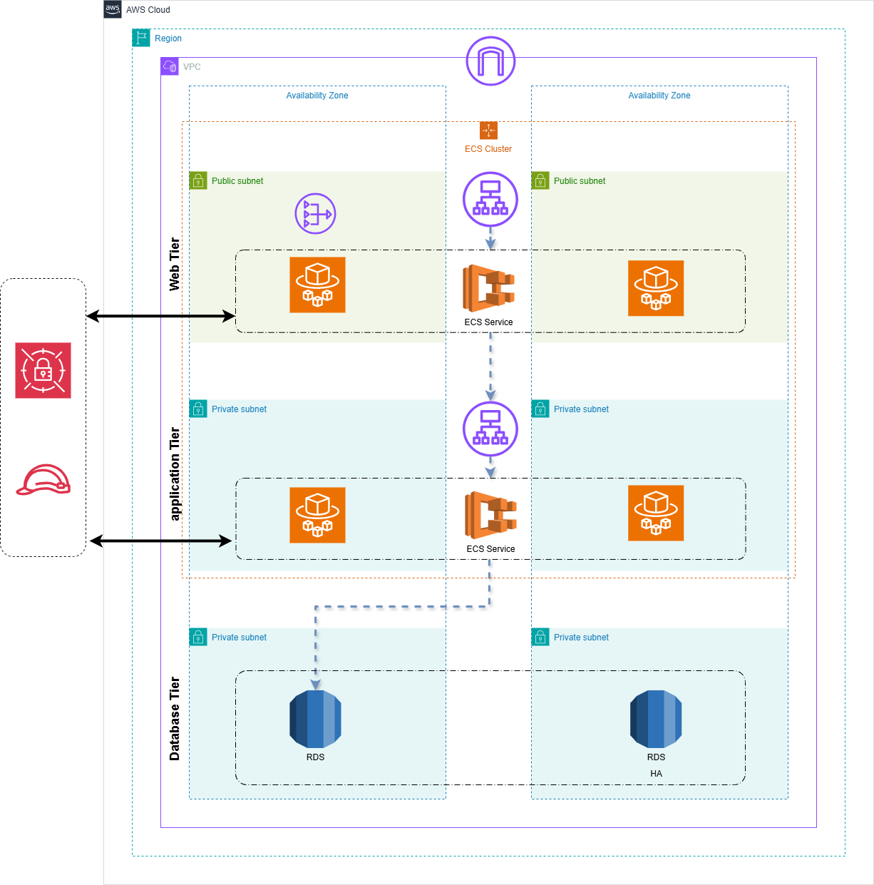

# Fargate Three-Tier Architecture on AWS with Terraform



This project implements a three-tier architecture on AWS using Terraform. It leverages AWS Fargate for container orchestration, along with other AWS services such as VPC, ALB, RDS, and Secrets Manager.

## Architecture Overview

The architecture consists of the following layers:
1. **Presentation Layer (Frontend)**: Hosted on AWS Fargate, behind an Application Load Balancer (ALB).
2. **Application Layer (Backend)**: Hosted on AWS Fargate, behind an internal ALB.
3. **Data Layer (Database)**: A MySQL database hosted on Amazon RDS.

## Features

- **Infrastructure as Code**: Fully automated deployment using Terraform.
- **Secure Secrets Management**: Database credentials are stored in AWS Secrets Manager and encrypted with KMS.
- **Scalable and Highly Available**: Uses multiple Availability Zones for redundancy.
- **Logging and Monitoring**: CloudWatch Logs for ECS tasks.

## Project Structure

```
terraform-3tier-app/
├── main.tf                 # Main module to orchestrate all submodules
├── variables.tf            # Input variables for the project
├── outputs.tf              # Outputs for the project
├── backend.tf              # S3 backend configuration for Terraform state
├── modules/
│   ├── compute/            # ALB and target groups
│   ├── ECS/                # ECS cluster, services, and task definitions
│   ├── iam/                # IAM roles and policies
│   ├── networking/         # VPC, subnets, and route tables
│   ├── secrets/            # Secrets Manager and KMS
│   ├── securitygroup/      # Security groups
│   ├── storage/            # RDS database
├── .gitignore              # Git ignore file
└── README.md               # Project documentation
```

## Prerequisites

- Terraform v1.3.0 or later
- AWS CLI configured with appropriate credentials
- An existing S3 bucket for Terraform state

## Usage

1. **Clone the Repository**:
   ```bash
   git clone https://github.com/your-repo/Fargate-Three-Tier-Architecture-AWS-Terraform.git
   cd Fargate-Three-Tier-Architecture-AWS-Terraform
   ```

2. **Initialize Terraform**:
   ```bash
   terraform init
   ```

3. **Plan the Deployment**:
   ```bash
   terraform plan
   ```

4. **Apply the Configuration**:
   ```bash
   terraform apply
   ```

5. **Destroy the Infrastructure** (if needed):
   ```bash
   terraform destroy
   ```

## Input Variables

The project uses several input variables defined in `variables.tf`. Below are some key variables:

- `public_key`: Name of the EC2 key pair.
- `public_subnet_cidrs`: CIDR blocks for public subnets.
- `private_subnet_cidrs`: CIDR blocks for private subnets.
- `db_user` and `db_password`: Database credentials.
- `backend_image_name` and `frontend_image_name`: Docker image names for backend and frontend.

## Outputs

After deployment, Terraform will output key information such as:
- VPC ID
- Public and private subnet IDs
- ALB DNS names
- Database address

## Security

- **Secrets Management**: Database credentials are securely stored in AWS Secrets Manager.
- **IAM Roles**: Fine-grained IAM policies are used to restrict access to resources.
- **Security Groups**: Configured to allow only necessary traffic between layers.

